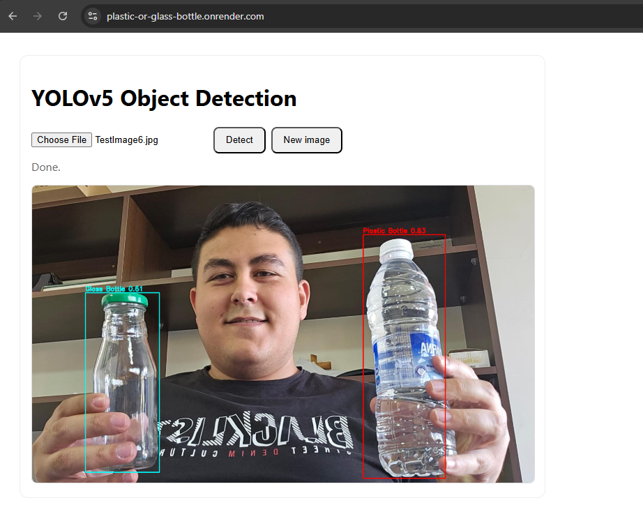

# Bottle Detection (Glass vs Plastic) — Flask · YOLOv5 · Docker · Render


> Minimal, productionized object detector. Upload an image → get an **annotated PNG** with glass/plastic bottle detections.





---


## What this model does

- Detects **Glass Bottle** and **Plastic Bottle** objects in images.

- Returns an **annotated image** directly (keeps the demo simple and visual).

- Applies a small **post‑processing filter** to reduce false positives (e.g., faces as bottles).


### Post‑processing rules

- `MAX_BOX_AREA_RATIO = 0.4` → drop very large **and centered** boxes (>40% of image area).

- `MIN_ASPECT_RATIO   = 1.5` → drop near‑square/wide boxes (bottles are typically tall).

- `CENTER_TOLERANCE   = 0.2` → defines “centered” (±20% of image width).


These thresholds live in `app/server.py` and can be tuned.


---


## Project structure

```

app/

&nbsp; server.py               # Flask app (app.py equivalent)

&nbsp; templates/

&nbsp;   index.html            # minimal upload UI (stays on page; “New image” button)

models/

&nbsp; best.pt                 # trained YOLOv5 weights

Dockerfile                # container build recipe (bundles local yolov5 clone)

requirements.txt          # runtime dependencies

docs/

&nbsp; preview.png             # screenshot or GIF of the app in action

```


> YOLOv5 stores class names inside `best.pt` (the `names` dict). No tokenizer/config files are required to run. If desired, include `data.yaml` from training for documentation.


---


## Prerequisites

- **Docker** (for the recommended path below)

- Optional for local dev: **conda/Python 3.10**


---


## Quickstart — run with Docker (recommended)


Build the image locally:

```bash

docker build -t objdet:latest .

```


Run it:

```bash

docker run --rm -p 8080:8080 objdet:latest

# open http://127.0.0.1:8080

```


**Health check:** visit `http://127.0.0.1:8080/health` → should return `ok`.


> The Dockerfile bundles a local clone of `ultralytics/yolov5` so the container doesn’t need network access at startup.


---


## Run locally (without Docker)


```bash

conda create -n objdet python=3.10 -y

conda activate objdet

pip install torch==2.2.2 torchvision==0.17.2 --index-url https://download.pytorch.org/whl/cpu

pip install -r requirements.txt

python app/server.py

# open http://127.0.0.1:8080

```


---


## Using the interface

1. Open the home page and **upload** a JPG/PNG.

2. Click **Detect** — results appear on the **same page** as an annotated image.

3. Click **New image** to try another file.

4. **Endpoints:**

&nbsp;  - `GET /` — upload UI

&nbsp;  - `POST /predict` — returns annotated PNG

&nbsp;  - `GET /health` — returns `ok`


---


## Known issues / limitations

- **Free‑tier cold start (Render):** if deployed on free tier, first request after ~15 minutes may be slow.

- **CPU inference:** fine for demos; GPU hosting would increase throughput.

- **Large images:** can slow inference. Consider adding upload size limits.


---


## Troubleshooting

- Missing packages when running in Docker → rebuild image (`docker build -t objdet:latest .`).

- Port already in use → run with another host port: `docker run -p 8081:8080 objdet:latest` and open `http://127.0.0.1:8081`.

- If your repo is public and `models/best.pt` is **>100 MB**, use **Git LFS**:

&nbsp; ```bash

&nbsp; git lfs install

&nbsp; git lfs track "*.pt"

&nbsp; git add .gitattributes

&nbsp; ```


---


## Versions (runtime)

- Python 3.10

- PyTorch **2.2.2** (CPU) + TorchVision **0.17.2**

- Ultralytics **8.3.179**

- Flask **3.0.3**, Gunicorn **22.0.0**

- Pillow, OpenCV‑Python‑Headless, NumPy, Matplotlib, Seaborn


---


## License & attribution

- Model framework: **YOLOv5** by Ultralytics (AGPL‑3.0). See the YOLOv5 repository for license details.


